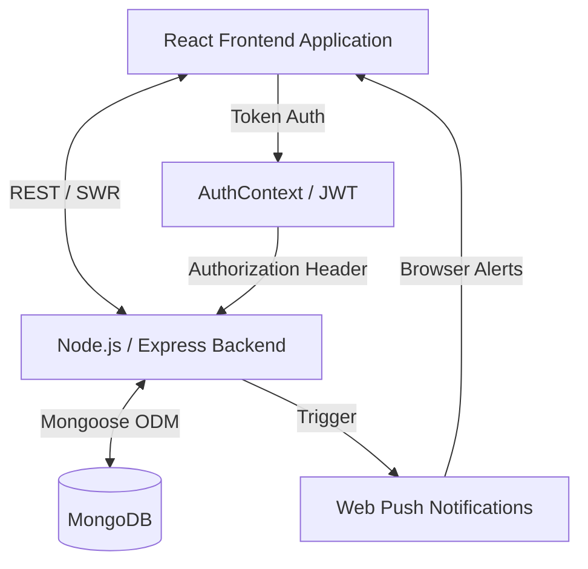

# Architecture & Technical Design

The Unique-Care platform adopts a decoupled client-server architecture, allowing the frontend client to scale independently of the API and database layers.

## High-Level Architecture

## Communication & Integration

### Data Fetching
The frontend relies heavily on **SWR (Stale-While-Revalidate)** to fetch remote data. 
- SWR continuously polls or revalidates data on focus, simulating real-time updates for critical dashboards (e.g., Issue Trackers, Technician Queues).
- Standard REST API patterns (`GET`, `POST`, `PUT`, `DELETE`) are exposed by the Node.js backend to facilitate mutations (e.g., updating incident statuses, submitting reports).

### Authentication & Authorization
- **Token-Based:** The application utilizes JSON Web Tokens (JWT). Upon successful login, the backend returns a token, which is persisted locally (e.g., `localStorage`) by the frontend `AuthContext`.
- **Role-Based Access Control (RBAC):** Users are assigned one of three roles: `student`, `technician`, or `admin`.
- **Middleware Protection:** The backend `protect` middleware decodes JWTs, and the `authorize` middleware ensures endpoints are only accessible to the correct roles (e.g., only admins can approve part requisitions).

### Notification Pipeline
To ensure prompt responses to facility failures, Unique-Care incorporates a robust notification pipeline:
1. **Trigger:** A new `Issue` or `Incident` is saved to MongoDB.
2. **Service Layer:** The backend `notificationService.ts` logs an in-app `Notification` record.
3. **Push Relay:** Simultaneously, `pushService.ts` looks up the Web Push Subscriptions for relevant roles (Admins/Technicians) and broadcasts real-time browser alerts.
